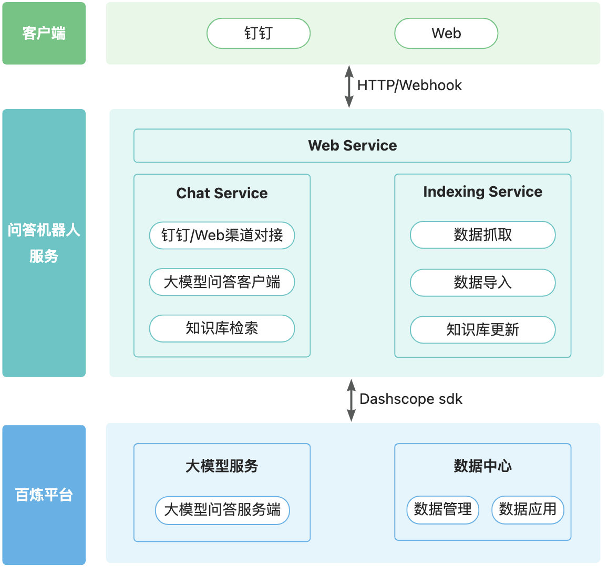
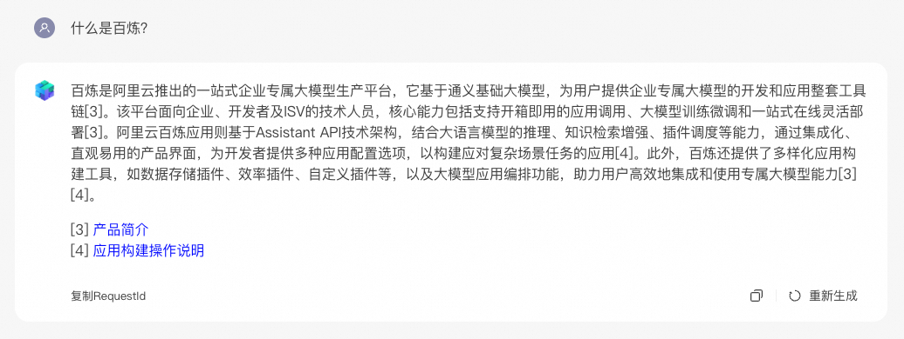
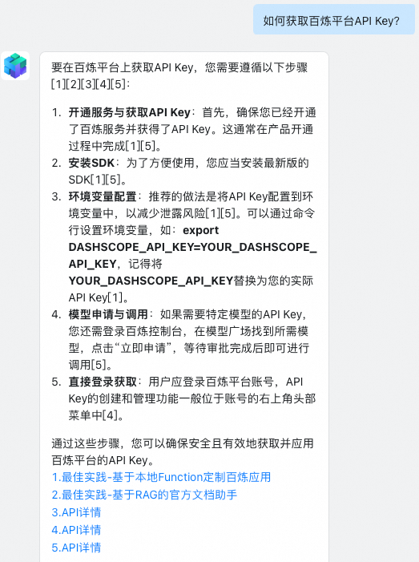

### 项目简介
本项目以百炼文档问答助手为例，展示如何基于LlamaIndex在百炼平台上搭建文档问答应用。
基于百炼平台的底座能力，以官方帮助文档为指定知识库，搭建了问答机器人，支持钉钉、Web访问，旨在提供友好、便捷的百炼文档问答服务。

项目框架如下：



其中，
- 百炼平台：使用到了大模型服务和数据中心两个能力，其中大模型服务提供通义千问系列大模型的问答服务；数据中心提供了“数据管理-导入数据”和“数据应用-知识索引”能力，将文档内容导入知识库中，供检索使用。
- 问答机器人服务，包括：
  - Chat Service：调用大模型问答API，检索知识库，并将结果以流式输出，对接Web和钉钉机器人。
  - Indexing Service：从网页抓取数据，通过百炼平台导入数据并创建索引，最终导入知识库，用于后续的检索。
### 使用方式

##### 安装依赖
```
pip install -r requirements.txt
```

##### 修改配置
```
修改settings.py中配置项
```

##### 编译打包

```
./build.sh
```

##### 启动和运行

```
cd build/bailian-support/target/bailian-support

env DASHSCOPE_API_KEY=sk-*** gunicorn --timeout 300 --config gunicorn.py main:app
```

##### 测试页面
http://localhost:8080/

##### Web测试效果


##### 钉钉测试效果
